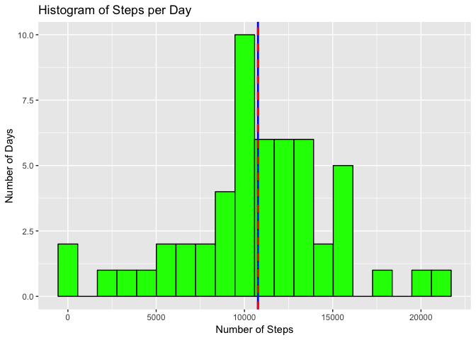
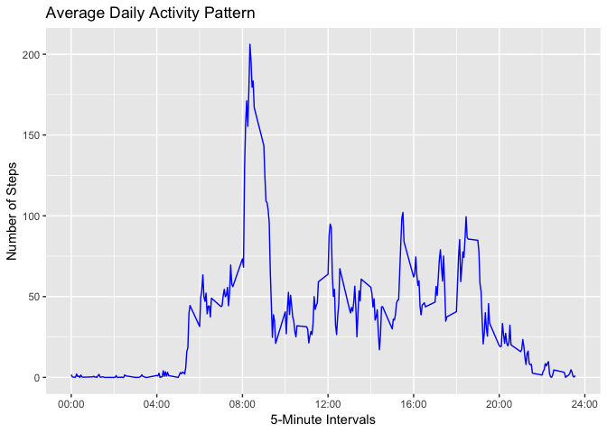
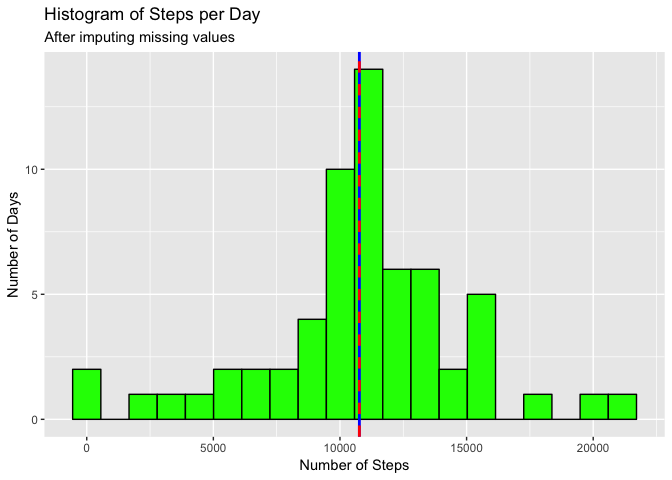
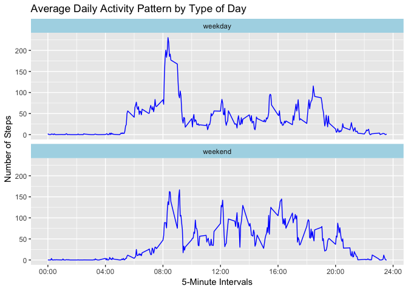

## Loading and preprocessing the data


```r
activityData <- read.csv("./activity.csv", sep = ",")
activityData$date <- as.Date(activityData$date)
```

Some informations about the data are shown below:


```r
str(activityData)
```

```
## 'data.frame':	17568 obs. of  3 variables:
##  $ steps   : int  NA NA NA NA NA NA NA NA NA NA ...
##  $ date    : Date, format: "2012-10-01" "2012-10-01" ...
##  $ interval: int  0 5 10 15 20 25 30 35 40 45 ...
```

```r
summary(activityData)
```

```
##      steps           date               interval   
##  Min.   :  0    Min.   :2012-10-01   Min.   :   0  
##  1st Qu.:  0    1st Qu.:2012-10-16   1st Qu.: 589  
##  Median :  0    Median :2012-10-31   Median :1178  
##  Mean   : 37    Mean   :2012-10-31   Mean   :1178  
##  3rd Qu.: 12    3rd Qu.:2012-11-15   3rd Qu.:1766  
##  Max.   :806    Max.   :2012-11-30   Max.   :2355  
##  NA's   :2304
```

## What is the mean total number of steps taken per day?

First the number of steps per day is computed, ignoring days with missing values.


```r
vSteps <- aggregate(steps ~ date, data = activityData, sum, na.rm = TRUE)
```

Then a histogram of the total number of steps taken each day is made. The mean and median
total number of steps taken per day are computed and shown in the graphic.


```r
library(ggplot2)
meanSteps = mean(vSteps$steps, na.rm = TRUE)
medianSteps = median(vSteps$steps, na.rm = TRUE)
ggplot() + labs(title = "Histogram of Steps per Day", x = "Number of Steps",
                y = "Number of Days") +
        geom_histogram(aes(x = vSteps$steps), color = "black", fill = "green", bins = 20) +
        geom_vline(xintercept = meanSteps, color = "blue", size = 1) +
        geom_vline(xintercept = medianSteps, color = "red", size = 1, lty = 2)
```

<!-- -->

The mean total number of steps taken per day is **10766.19**, represented in the graphic
by the vertical line in blue.

The median total number of steps taken per day is **10765**, represented in the
graphic by the vertical line in red.

## What is the average daily activity pattern?

First the average number of steps taken by 5-minute interval is computed, averaged across
all days.


```r
vStepsI <- aggregate(steps ~ interval, data = activityData, mean, na.rm = TRUE)
```

Now a time series plot of the 5-minute interval (x-axis) and the average number of steps taken, averaged across all days (y-axis), is made to show the average daily activity pattern.


```r
ggplot(vStepsI, aes(interval, steps)) +
        labs(title = "Average Daily Activity Pattern", y = "Number of Steps") +
        geom_line(colour = "blue") +
        scale_x_continuous(name = "5-Minute Intervals",
                           breaks = c(0000, 0400, 0800, 1200, 1600, 2000, 2400),
                           labels = c("00:00", "04:00", "08:00", "12:00", "16:00",
                                      "20:00", "24:00"))
```

<!-- -->

And the 5-minute interval that contains the maximum number of steps is found.


```r
iMax <- which.max(vStepsI$steps)
maxSteps <- vStepsI$steps[iMax]
maxInterval <- as.character(vStepsI$interval[iMax])
maxInterval <- paste0(as.character(rep(0, 4-nchar(maxInterval))), maxInterval)
maxInterval <- format(strptime(maxInterval, format="%H%M"), format = "%H:%M")
```

The maximum number of steps is **206.17** and the 5-minute interval that contains it is
**08:35**.

## Imputing missing values

First the number of missing values is computed.


```r
nMissingValues <- sum(is.na(activityData$steps))
```

The number of rows with missing values is **2304**.

Now the missing values are imputed with the strategy that uses the mean of the 5-minute
intervals and a new dataset is created.


```r
completeActivity <- cbind(activityData)
completeActivity$steps[is.na(activityData$steps)] <- vStepsI$steps
write.csv(completeActivity, file = "./completeActivity.csv", row.names = FALSE)
```

A summary of the new data is shown below:


```r
summary(completeActivity)
```

```
##      steps          date               interval   
##  Min.   :  0   Min.   :2012-10-01   Min.   :   0  
##  1st Qu.:  0   1st Qu.:2012-10-16   1st Qu.: 589  
##  Median :  0   Median :2012-10-31   Median :1178  
##  Mean   : 37   Mean   :2012-10-31   Mean   :1178  
##  3rd Qu.: 27   3rd Qu.:2012-11-15   3rd Qu.:1766  
##  Max.   :806   Max.   :2012-11-30   Max.   :2355
```

Then the number of steps per day are aggregated.


```r
vCompSteps <- tapply(completeActivity$steps, completeActivity$date, sum)
```

And a new histogram of the total number of steps taken each day is made for the complete activity dataset. The mean and median total number of steps are also computed.


```r
library(ggplot2)
meanCompSteps = mean(vCompSteps)
medianCompSteps = median(vCompSteps)
ggplot() + labs(title = "Histogram of Steps per Day",
                subtitle = "After imputing missing values",
                x = "Number of Steps", y = "Number of Days") +
        geom_histogram(aes(x = vCompSteps), color = "black", fill = "green", bins = 20) +
        geom_vline(xintercept = meanCompSteps, color = "blue", size = 1) +
        geom_vline(xintercept = medianCompSteps, color = "red", size = 1, lty = 2)
```

<!-- -->

After imputing missing values, the mean total number of steps taken per day is
**10766.19**, represented in the graphic by the vertical line in blue, and the
median total number of steps taken per day is **10766.19**, represented in the
graphic by the vertical line in red.

The histogram shows that there wasn't a great impact from imputing missing data with the 
chosen strategy. The mean is the same of the original data and the median has increased
towards the mean.

## Are there differences in activity patterns between weekdays and weekends?

First a factor vector is created with the levels "weekday" and "weekend" and its values
are assigned according to the values of the date variable. The data is aggregated by
interval, day type, and the computed average steps.


```r
dayFactor <- factor(weekdays(completeActivity$date) %in% c("Saturday", "Sunday"),
                     labels = c("weekday", "weekend"), ordered = FALSE)
vStepsIDays <- aggregate(completeActivity$steps,
                         by = list(completeActivity$interval, dayFactor), mean)
names(vStepsIDays) <- c("interval", "dayType", "avgSteps")
```

Then a panel plot containing a time series plot of the 5-minute interval and the average
number of steps taken, averaged across all weekday or weekend days, is made.


```r
ggplot(vStepsIDays, aes(x = interval, y = avgSteps)) +
        labs(title = "Average Daily Activity Pattern by Type of Day", y = "Number of Steps") +
        geom_line(colour = "blue") + facet_wrap(~dayType, ncol = 1) +
        theme(strip.background = element_rect(fill = "light blue")) +
        scale_x_continuous(name = "5-Minute Intervals",
                           breaks=c(0000, 0400, 0800, 1200, 1600, 2000, 2400),
                           labels=c("00:00", "04:00", "08:00", "12:00", "16:00",
                                    "20:00", "24:00"))
```

<!-- -->

We can see from the two plots that there are different activity patterns between weekdays and at the weekends. During daytime at weekdays there is a peak in the morning and at weekends there are less activity early in the morning.
